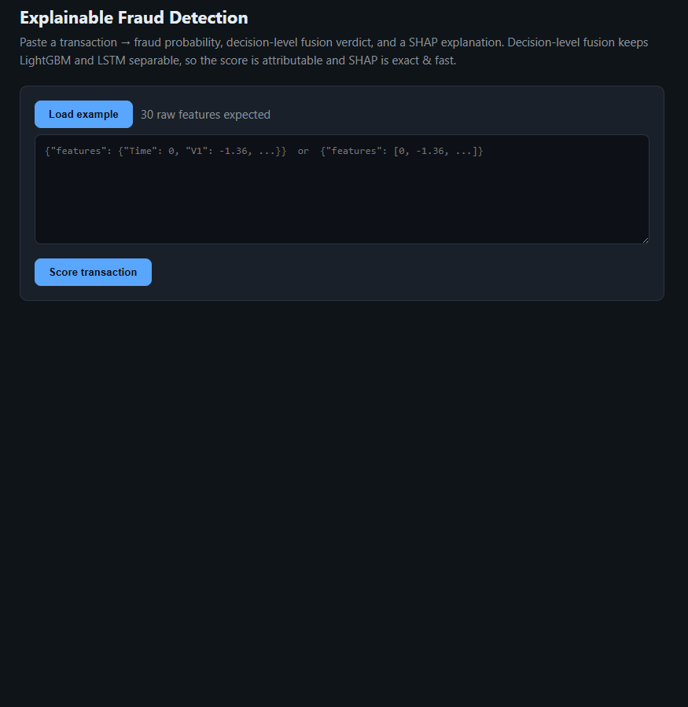

# Real-Time Explainable Fraud Detection — LightGBM · LSTM · SHAP

[](https://github.com/Leonardasvekrikas-source/fraud-detection-system/actions/workflows/ci.yml)
[](https://huggingface.co/spaces/Leonardasvekrikas-source/fraud-detection-demo)
[](https://www.python.org/)
[](LICENSE)

> A real-time, explainable credit-card fraud detection service, and the engineering study
> behind its architecture. Not "deploy my model" — an argument, with a deployed system as the proof.

**▶ Live demo:** https://huggingface.co/spaces/Leonardasvekrikas-source/fraud-detection-demo — paste a transaction, get a fraud probability + verdict + a SHAP explanation of the top contributing features.

<a href="https://huggingface.co/spaces/Leonardasvekrikas-source/fraud-detection-demo">
  
</a>


**The argument (two sentences).** A *decision-level* fusion of LightGBM and LSTM — keeping the
two models separate and combining their scores — is the more practical production choice than
*feature-level* fusion for this problem: it is simpler, lower-latency, and stays explainable
because the models remain separable (fast SHAP `TreeExplainer` on the gradient-boosted
component) and it adds a human-in-the-loop *Expert-Checking* tier for ambiguous cases. In this
study, an attempt at feature-level fusion added complexity without a practical detection benefit
(a cautious, setup-dependent negative result), while decision-level fusion stayed competitive on
ranking (AUC ≈ 0.97).

> **Honest scope note.** On raw detection score, **LightGBM alone is the strongest single model**
> here (see results). The decision-level fusion's value is not a higher F1 — it is competitive
> ranking *plus* simplicity, per-model attributability for explanations, and the Expert-Checking
> escalation. This repository is deliberately honest about what is measured, what is simulated,
> and what comes from the literature vs. this work.

---

## Status

This project ships in public phases. Current state:

| Phase | What | Status |
|------|------|--------|
| 0 | Reproducible core: config-driven training + evaluation of the pipeline, one command | 🟢 **both subsystems reproduced on real data** ✓ (LightGBM exact; LSTM within run-to-run noise) |
| 1 | Real-time explainable FastAPI service + SHAP explanation + demo UI, Dockerised | 🟢 **live on Hugging Face Spaces** |
| 2 | Fusion comparison + cost/threshold analysis + PaySim generalization, tracked in MLflow | 🟢 done — 3 MLflow experiments ([experiments/](experiments/)) |
| 3 | Drift monitoring (Evidently, *simulated*), Airflow retraining DAG (docker-compose), CI | 🟢 done — [monitoring/](monitoring/) + [airflow/](airflow/), CI green |
| 4 | Technical write-up linking the live demo and code | ⬜ not started |

`serving/`, `experiments/`, `monitoring/`, and `airflow/` are built out (each with its own README).
Only the Phase 4 write-up remains.

---

## Results (replication of Yousefimehr & Ghatee, 2025)

European Credit Card dataset, 5-fold cross-validation (mean ± std). "Original" = the source
paper's reported figures. These reproduce the thesis behind this project.

| Metric | LightGBM (ours) | LightGBM (orig.) | LSTM (ours) | LSTM (orig.) |
|---|---|---|---|---|
| F1 | **0.8503 ± 0.0124** | 0.8805 | 0.7723 ± 0.0576 | 0.8310 |
| AUC | **0.9851 ± 0.0049** | 0.9603 | 0.9525 ± 0.0247 | 0.8922 |
| Precision | 0.8984 ± 0.0427 | 0.8446 | 0.9204 ± 0.0708 | 0.8835 |
| Recall | 0.8092 ± 0.0256 | 0.9209 | 0.6729 ± 0.0895 | 0.7846 |
| MCC | 0.8518 ± 0.0131 | 0.8815 | 0.7841 ± 0.0537 | 0.8323 |

The fusion-strategy comparison, the threshold-as-cost analysis, and the PaySim generalization run
are **reproducible, MLflow-tracked experiments** — see [`experiments/`](experiments/) for the
result tables, plots, and the honest findings (including feature-level fusion's collapse and
where the LSTM under-performs).

> Both rows are **reproduced by this repository's code** on the real dataset. LightGBM matches
> the thesis exactly (deterministic, seed 42). A fresh LSTM re-run gave F1 0.743 / AUC 0.951 /
> precision 0.916 / recall 0.643 — within LSTM run-to-run noise of the thesis figures shown
> (AUC matches to 0.002); LSTM training is seed-fixed but not bit-reproducible across TensorFlow
> versions. The documented `HybridUS` edge case fires as expected (distribution-protected
> normals exceed the undersampling budget, so the LSTM trains near the original imbalance).
> The LSTM's lower recall traces to a documented `HybridUS` edge case under extreme imbalance
> (the undersampling budget is exhausted by distribution-protected samples), not an
> implementation error — see [`docs/`](docs/).

---

## Quickstart

Requires **Python 3.12**.

```bash
# 1. Clone
git clone <repo-url>
cd "Fraud detection system"

# 2. Install (editable). Add extras as needed:
#      [dev]  tests+lint   [lstm]  TensorFlow for Subsystem 2 / full-fusion training
#      [serve]  FastAPI+SHAP demo (lean, no TF)
python -m venv .venv
. .venv/Scripts/activate            # Windows;  use .venv/bin/activate on macOS/Linux
pip install -e ".[dev,lstm]"        # LightGBM-only work needs just ".[dev]"

# 3. Fetch the public datasets (Kaggle) into data/
python scripts/fetch_data.py --dataset european

# 4. Reproduce the thesis numbers — one command
fraud-detect evaluate --subsystem 1        # LightGBM branch, 5-fold CV
fraud-detect evaluate --subsystem 2        # LSTM branch
fraud-detect train --save artifacts/       # train once and persist a servable model
```

**Or skip the setup — try the [live demo](https://huggingface.co/spaces/Leonardasvekrikas-source/fraud-detection-demo).**

---

## Architecture

```
                Raw transaction CSV
                        │
        dedup ─► F2Vote feature selection (fit once)
                        │
        ┌───────────────┴────────────────┐
        ▼                                 ▼
  Subsystem 1                       Subsystem 2
  scale ─► HybridOS ─► LightGBM     scale ─► HybridUS ─► window(W=3) ─► LSTM
        │  P1 = P(fraud)                  │  P2 = P(fraud)
        └───────────────┬────────────────┘
                        ▼
        Decision-level fusion (Algorithm 1):  P_sum = P1 + P2
          P_sum < θ         → Normal
          P_sum ≥ 1 + θ     → Fraud
          else              → Expert-Checking   (θ = 0.5)
                        │
        SHAP TreeExplainer on LightGBM → per-feature explanation
```

<!-- TODO(Phase 0): replace with a rendered diagram (docs/architecture.png). -->

---

## What's mine vs. what's from the literature

- **From the literature** — the hybrid *method*: the LightGBM + LSTM dual-subsystem design,
  HybridOS/HybridUS distribution-preserving resampling, F2Vote feature selection, the
  Algorithm-1 decision-level fusion, and the SHAP/LIME explainability pairing. Source:
  **Yousefimehr, B. & Ghatee, M. (2025).** *A distribution-preserving method for resampling
  combined with LightGBM-LSTM for sequence-wise fraud detection in credit card transactions.*
  *Expert Systems with Applications*, **262**, 125661. doi:10.1016/j.eswa.2024.125661
- **Mine** — the independent reimplementation; the fusion experiment (feature-level vs
  decision-level) and its negative result; the second-dataset (PaySim) generalization test; the
  systematic SHAP/LIME interpretability analysis; the cost/threshold framing; the serving
  system, explainability API, and demo; and the engineering conclusions drawn from all of it.

---

## Stack

Python 3.12 · LightGBM · TensorFlow/Keras (LSTM) · scikit-learn · imbalanced-learn · SHAP/LIME ·
FastAPI (Phase 1) · MLflow (Phase 2) · Evidently + Airflow (Phase 3) · Docker · Hugging Face Spaces.

---

## Repository map

```
config/            YAML configuration (hyperparameters, θ, window size — the source of truth)
data/              Datasets live here (gitignored); fetched via scripts/fetch_data.py
docs/              Thesis manuscript + method/results write-ups (source materials)
scripts/           fetch_data.py and other one-off utilities
src/fraud_detection/
  config.py        Loads config/default.yaml (with safe built-in defaults)
  data/            Dataset loading + validation
  preprocessing/   dedup, StandardScaler, F2Vote, HybridOS, HybridUS, windowing
  models/          LightGBM + LSTM wrappers
  evaluation/      Metrics (F1, AUC, MCC, ...)
  fusion/          Decision-level fusion engine (Algorithm 1)
  pipelines/       subsystem1, subsystem2, train (train-once + persist)
  artifacts/       Save/load fitted model + scaler + F2Vote mask
  cli.py           `fraud-detect train | evaluate`
tests/             pytest suite for the pure-logic modules
serving/      Phase 1 — FastAPI + SHAP demo (deployed to Hugging Face Spaces)
experiments/  Phase 2 — MLflow fusion / cost-threshold / PaySim studies + results
monitoring/   Phase 3 — Evidently drift monitoring (simulated)
airflow/      Phase 3 — champion/challenger retraining DAG (docker-compose)
```

---

## License

[MIT](LICENSE).
