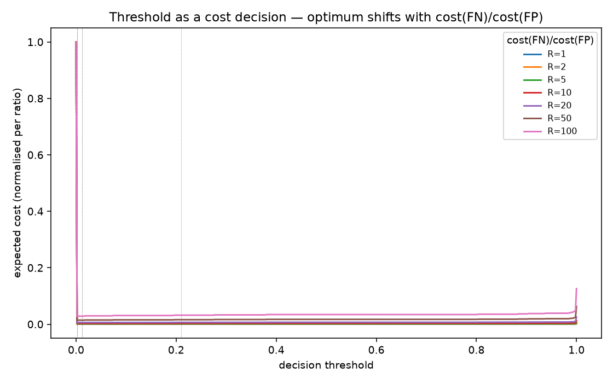
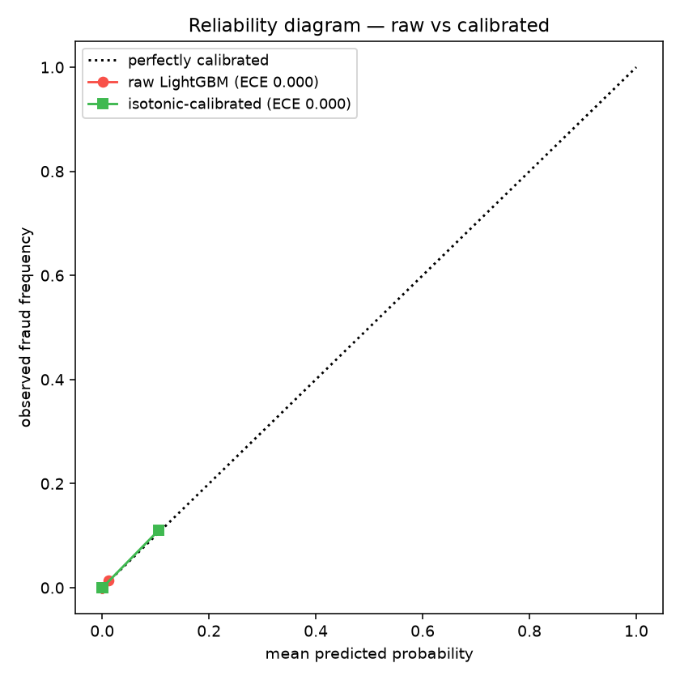

# experiments/ — Phase 2: the study, made legible

Reproducible, **MLflow-tracked** experiments that turn the thesis's arguments into numbers
anyone can regenerate. Tracking uses a local SQLite backend (MLflow 3 retired the file store):

```bash
pip install -e ".[lstm,experiments]"
python -m fraud_detection.experiments.fusion_comparison     --data creditcard.csv
python -m fraud_detection.experiments.threshold_cost        --data creditcard.csv
python -m fraud_detection.experiments.calibration           --data creditcard.csv
python -m fraud_detection.experiments.paysim_generalization --data paysim.csv
mlflow ui --backend-store-uri sqlite:///mlflow.db           # browse runs at :5000
```

Result tables/plots are written to `experiments/results/` and committed as evidence.

## 1. Fusion comparison — feature-level vs decision-level ✅

`fusion_comparison.py` trains both base models on one aligned chronological 60/20/20 split,
extracts LightGBM leaf embeddings (PCA→50) and LSTM hidden states, trains the feature-level
MLP meta-classifier, and evaluates all four configs on the same test set.

| config | precision | recall | F1 | AUC |
|---|---|---|---|---|
| LightGBM (Subsystem 1) | 0.963 | 0.703 | 0.813 | 0.964 |
| LSTM (Subsystem 2) | 1.000 | 0.676 | 0.806 | 0.972 |
| **decision-level fusion** (Algorithm 1) | 1.000 | 0.608 | 0.756 | 0.972 |
| **feature-level fusion** (leaf ⊕ hidden → MLP) | 0.032 | 0.905 | **0.062** | 0.968 |

**Finding.** Feature-level fusion keeps competitive *ranking* (AUC 0.968) but its precision and
F1 collapse — its learned decision boundary is miscalibrated by the extreme class imbalance in
the meta-classifier's training data (the leaf embeddings, compressed 5000→50 by PCA, retain
only ~59% variance). Decision-level fusion stays clean with far less machinery. This reproduces
the thesis result (LSTM F1 and feature-level recall match to the digit) and is the empirical
backbone of the project's argument: **decision-level fusion is the better production choice.**

## 2. Threshold as a cost decision ✅

`threshold_cost.py` sweeps the LightGBM threshold and, for a range of cost ratios
`R = cost(false negative) / cost(false positive)`, finds the expected-cost-minimising operating
point — reframing the PR curve as a business decision (fraud loss vs false-alarm friction).

**Finding.** As a missed fraud grows costlier, the optimal threshold drops sharply (0.21 → 0.002)
— but recall plateaus at ~0.79: a residual ~23 frauds are scored near-zero by LightGBM and can't
be recovered by *any* threshold. That ceiling is exactly the case for the sequential (LSTM)
signal and the Expert-Checking tier — threshold tuning alone can't catch them.




## 3. Probability calibration — are the scores trustworthy? ✅

`calibration.py` — fraud teams *act on scores* ("block > 0.9, review 0.5–0.9"), so a score of 0.8
must mean ~80% of such transactions really are fraud. Our LightGBM is trained on HybridOS-resampled
data (~5% fraud) while the true base rate is ~0.17%, so its raw probabilities are **inflated**. This
quantifies it (Brier, ECE) and fixes it with post-hoc **isotonic regression** fit on a held-out slice
at the true base rate.

| ECE (Expected Calibration Error) | raw | isotonic-calibrated |
|---|---|---|
| all transactions | 0.0004 | 0.0002 |
| **flagged region** (score ≥ 0.05, n=59) | **0.075** | **0.020** |

**Finding — and a rigor point.** The *aggregate* ECE is near-zero and **misleading**: the ~99.8%
easy negatives (scored ≈0) swamp it. In the **region the model actually acts on**, the raw scores are
7.5% miscalibrated (resampling inflation); isotonic calibration cuts that ~3.7×. Lesson: on extreme
imbalance, aggregate calibration metrics hide the problem — measure it where decisions happen.




## 4. PaySim generalization — second-dataset evidence ✅

`paysim_generalization.py` runs the pipeline on the structurally different PaySim dataset
(interpretable mobile-money features, not PCA). PaySim-specific preprocessing drops identifier/
constant columns and one-hot encodes `type`. **Tractability:** PaySim has ~1.05M rows, so only
the LSTM (whose HybridUS runs OCSVM on the huge normal class) uses a **contiguous** 200k tail
block — contiguous, so transaction sequences survive; LightGBM's OCSVM runs on the tiny fraud
class, so it trains on the **full** train split.

| config | precision | recall | F1 | AUC |
|---|---|---|---|---|
| LightGBM | 0.735 | 0.706 | 0.721 | 0.992 |
| LSTM | 0.977 | 0.060 | 0.114 | 0.961 |
| decision-level fusion | 1.000 | 0.060 | 0.114 | 0.982 |

**Finding.** LightGBM generalises strongly to PaySim — AUC 0.992 and recall 0.706, essentially
matching the thesis (0.997 / 0.718). The LSTM *ranks* fraud well (AUC 0.96) but is under-confident
at the 0.5 threshold (low recall): its 200k tail holds only ~195 fraud, and the HybridUS edge
case leaves it on ~0.1% fraud. This supports the thesis conclusion: the architecture **transfers**,
but PaySim fraud is more concentrated and **less sequential**, so the tabular (LightGBM) branch
carries the signal while the sequential branch adds little. This is a tractability-constrained
*indicator*, not a full faithful reproduction — see the module header for the exact approximations.
